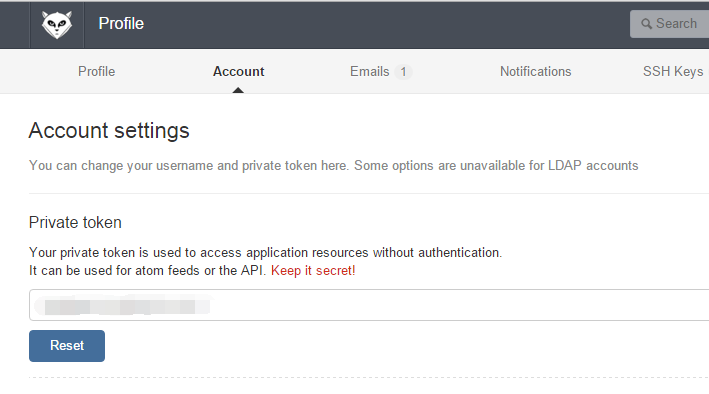

# gitlab-report-robot #

> GitLab工作报告自动生成工具

## 使用方法 ##

1. 克隆项目：`git clone https://github.com/peigong/gitlab-report-robot.git`
2. 进入目录：`cd gitlab-report-robot`
3. 根据下文，配置 `grr.json`
4. `shift+右键菜单`，选择在此处打开命令窗口
5. 建立NPM链接：`npm link`
6. 生成报表：`node ./bin/grr.js`

**备注：**再次生成报表时，只需执行第6步。

## 配置文件 `grr.json` ##

在项目根目录下，定义配置文件 `grr.json`：

	{
	    "gitlab": "",
	    "email": ["", ""],
	    "token": ""
	}

**配置节含义：**

- **gitlab：**使用的`gitlab`服务的URL地址，用于访问`v3 api`。
- **email：**需要抓取的git提交记录的用户邮件。可以是一个字符串，也可以是一个字符串的数组。
- **token：**用于访问`v3 api`的`token`。

### 取得 `token` ###

在gitlab上，通过`Profile->Account settings`，复制`Private token`的值，作为配置文件中的token。

**如图：**

## GIT日志规范 ##

为了生成较规范的报告样式，代码提交时的日志信息需要按如下格式填写：

	【项目名称】代码更改的主题
	具体需要说明的细节

说明：

- 中括号中的内容是准备写入工作报告的项目名称（中括号可以使用中文括号，也可以使用英文括号）。
- 中括号后面的内容是准备写入工作报告的内容。
- 其他需要说明的细节需要**换行**书写。

## 参考 ##

- [GitLab Documentation](http://docs.gitlab.com/ce/)
- [GitLab API:Automate GitLab via a simple and powerful API.](http://docs.gitlab.com/ce/api/README.html)
